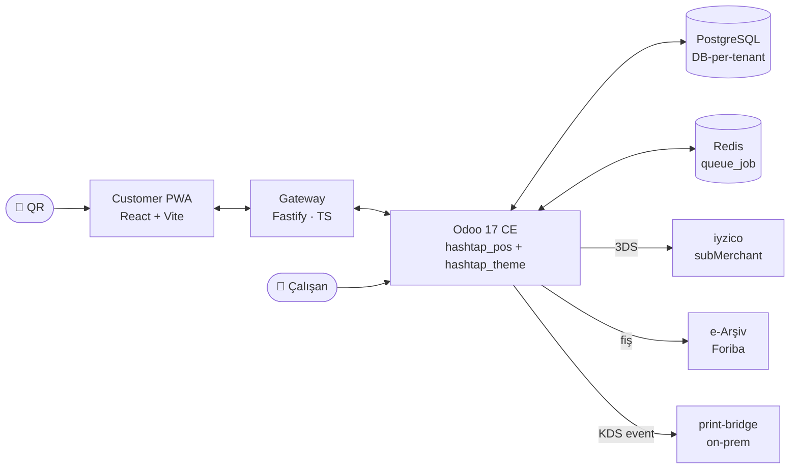

<div align="center">

<picture>
  <source media="(prefers-color-scheme: dark)" srcset="docs/assets/logo-dark.svg">
  
</picture>

### Restoranlar için QR sipariş ve ödeme platformu

Müşteri QR okutur → telefonda menüden seçer → telefondan öder.<br/>
Sipariş mutfağa, para doğrudan restoranın hesabına gider.

[](./docs/STATUS.md)
[](./docs/adr/0010-v17-lts.md)
[](./apps)
[](./odoo-addons)
[](#lisans)

[Ürün](./docs/PRODUCT.md) · [Durum](./docs/STATUS.md) · [Yol haritası](./docs/ROADMAP.md) · [Mimari](./docs/ARCHITECTURE.md) · [Kurulum](./docs/DEV_SETUP.md) · [ADR'ler](./docs/adr/)

</div>

---

## Ne yapıyor?

HashTap, restoranın mevcut iş akışını **değiştirmeden** çalışan bir sipariş + ödeme kanalıdır. Garson hâlâ servisi yapar; QR'ı okutan müşteri sipariş vermek ve ödemek için garsonu beklemez. Ek donanım gerekmez.

| Taraf | Dokunduğu |
|---|---|
| **Müşteri** | Telefonda PWA — QR → menü → sepet → 3DS ödeme → e-Arşiv fişi e-posta |
| **Restoran** | Odoo native panel — siparişler, masa planı, menü editörü, rapor |
| **HashTap (biz)** | Multi-tenant Odoo + gateway — kiracı provizyon, iyzico subMerchant, e-Arşiv orkestrasyon |

## Mimari



Detaylı topoloji ve veri akışları: [docs/ARCHITECTURE.md](./docs/ARCHITECTURE.md).

## Yığın

| Katman | Teknoloji |
|---|---|
| İş mantığı | **Odoo 17 CE** (Python) — [`odoo-addons/hashtap_pos`](./odoo-addons/hashtap_pos) |
| White-label | Odoo theme — [`odoo-addons/hashtap_theme`](./odoo-addons/hashtap_theme) |
| Müşteri PWA | TypeScript · React · Vite — [`apps/customer-pwa`](./apps/customer-pwa) |
| Gateway (BFF) | TypeScript · Fastify — [`apps/api`](./apps/api) |
| Yazıcı ajanı | TypeScript · Node on-prem — [`apps/print-bridge`](./apps/print-bridge) |
| POS adapter'ları | TypeScript — [`packages/pos-adapters`](./packages/pos-adapters) *(Segment B)* |
| DB | PostgreSQL 16 (DB-per-tenant, [ADR-0006](./docs/adr/0006-db-per-tenant.md)) |
| Async | `queue_job` (OCA) + Redis |
| Ödeme | iyzico — facilitator / subMerchant, Checkout Form (PCI SAQ-A) |
| e-Arşiv | Foriba (provider-agnostic arayüz) |
| Altyapı | Hetzner Cloud · Docker Compose · Caddy · systemd |

## Hızlı başlangıç

Gereksinimler: Node.js ≥ 20, Docker Compose, npm ≥ 10.

```sh
git clone https://github.com/burjucaglar/hashtap.git
cd hashtap
npm install

# Odoo + Postgres + Redis + MailHog
docker compose -f infra/odoo/docker-compose.yml up -d

# İlk DB'yi oluştur + modülleri yükle
docker compose -f infra/odoo/docker-compose.yml exec odoo \
  odoo -d demo -i hashtap_pos,hashtap_theme --stop-after-init

# Gateway ve müşteri PWA watch modda
npm run dev -w @hashtap/api
npm run dev -w @hashtap/customer-pwa
```

- Odoo: <http://localhost:8069> (DB: `demo`, admin: `admin` / `admin`)
- Gateway: <http://localhost:4000>
- PWA: Vite'ın verdiği port
- MailHog: <http://localhost:8025>

Tam akış: [docs/DEV_SETUP.md](./docs/DEV_SETUP.md).

## Durum ve yol haritası

- [x] **Faz 0** — Monorepo iskeleti
- [x] **Faz 1 · W1–W3** — Odoo + `hashtap_pos` / `hashtap_theme` iskeleti
- [x] **Faz 2 · W4–W5** — Menü modeli, masa yönetimi, QR üretimi
- [x] **Faz 3 · W6–W7** — Sipariş akışı + yaşam döngüsü
- [x] **Faz 4 · W8–W9** — iyzico 3DS (mock + stub; sandbox sözleşme bağımlı)
- [x] **Faz 5 · W10–W11** — e-Arşiv (mock + Foriba iskelet, **fail-close** aktif)
- [x] **Faz 6a · W12** — KDS (Kitchen Display) — `/hashtap/kds` ← *buradayız*
- [x] **Faz 7.5** — `hashtap_theme` white-label pass 1 (login + backend)
- [ ] **Faz 6b** — Print-bridge (pilot tetikli, ESC/POS)
- [ ] **Faz 7 · W13–W14** — POS adapter'ları (Segment B, partnership bağımlı)
- [ ] **Faz 8 · W15–W16** — Multi-tenant provizyon
- [ ] **Faz 9 · W17–W18** — Pilot hazırlık
- [ ] **Faz 10 · W19–W22** — Pilot

Haftalık iş paketleri + çıkış kriterleri: [docs/ROADMAP.md](./docs/ROADMAP.md) ·
anlık satır-satır durum: [docs/STATUS.md](./docs/STATUS.md).

## Dokümantasyon

| Doküman | İçerik |
|---|---|
| [PRODUCT.md](./docs/PRODUCT.md) | Vizyon, müşteri segmentleri (A/B/C), ticari model, MVP kapsamı |
| [STATUS.md](./docs/STATUS.md) | **Anlık durum panosu** — ne yapıldı, ne kaldı, son değişiklikler |
| [ROADMAP.md](./docs/ROADMAP.md) | W1–W22 fazları, iş paketleri, çıkış kriterleri |
| [KDS.md](./docs/KDS.md) | Kitchen Display System — rotalar, state akışı, operatör flow |
| [ARCHITECTURE.md](./docs/ARCHITECTURE.md) | Topoloji, bileşen sorumlulukları, veri akışları, hata modları |
| [MODULE_DESIGN.md](./docs/MODULE_DESIGN.md) | `hashtap_pos` iç yapısı — model, controller, servis |
| [DATA_MODEL.md](./docs/DATA_MODEL.md) | Alan seviyesinde model tanımları, dış JSON şemaları |
| [WHITE_LABEL.md](./docs/WHITE_LABEL.md) | Odoo markasının gizlenmesi — 13 override kategorisi |
| [MULTI_TENANCY.md](./docs/MULTI_TENANCY.md) | DB-per-tenant, onboarding, izolasyon, yedek, upgrade |
| [DEV_SETUP.md](./docs/DEV_SETUP.md) | Yerel geliştirme, tipik 4-terminal döngü, yaygın sorunlar |
| [DEPLOYMENT.md](./docs/DEPLOYMENT.md) | Prod topoloji, CI/CD, monitoring, yedek, ölçek yolu |
| [SECURITY.md](./docs/SECURITY.md) | Tehdit modeli, KVKK, PCI, RBAC, secret yönetimi |
| [integrations/IYZICO.md](./docs/integrations/IYZICO.md) | Facilitator/subMerchant, 3DS akışı, Apple/Google Pay |
| [integrations/E_ARSIV.md](./docs/integrations/E_ARSIV.md) | Fail-close politikası, Foriba, yeniden deneme stratejisi |
| [integrations/POS_ADAPTERS.md](./docs/integrations/POS_ADAPTERS.md) | 6 adapter tipi, menü sahipliği, Segment B akışı |
| [adr/](./docs/adr/) | Mimari karar kayıtları — monorepo, Odoo seçimi, v17, kurus tipi... |

## Repo yapısı

```
hashtap/
├── odoo-addons/
│   ├── hashtap_pos/        # iş mantığı: menü, sipariş, iyzico, e-Arşiv
│   └── hashtap_theme/      # white-label: logo, renk, login, e-posta
├── apps/
│   ├── customer-pwa/       # Müşteri PWA (React + Vite)
│   ├── api/                # Gateway (Fastify thin BFF)
│   └── print-bridge/       # On-prem: Raspberry Pi + ESC/POS
├── packages/
│   ├── shared/             # Ortak TS tipleri ve şemalar
│   └── pos-adapters/       # Segment B: SambaPOS, Adisyo, Local Agent…
├── infra/
│   ├── odoo/               # Dev stack: Odoo 17 + Postgres + Redis
│   └── docker-compose.yml  # Yardımcı dev DB + Adminer
└── docs/                   # PRODUCT, ROADMAP, ARCHITECTURE, ADR, integrations
```

## Kararlar ve ilkeler

Öne çıkan kararlar ([docs/adr/](./docs/adr/) içinde tam liste):

- **[ADR-0004](./docs/adr/0004-odoo-base.md)** — Odoo 17 CE tabanı. Kendi ERP'mizi sıfırdan yazmıyoruz, çatalamıyoruz; modül + white-label yazıyoruz.
- **[ADR-0005](./docs/adr/0005-module-not-fork.md)** — Modifikasyon hiyerarşisi: modül → inherit → override → monkey-patch (son çare) → core (yasak).
- **[ADR-0006](./docs/adr/0006-db-per-tenant.md)** — DB-per-tenant. Odoo Online bunu 10+ yıldır 50K+ kiracıyla kanıtladı.
- **[ADR-0008](./docs/adr/0008-customer-pwa-stays-ts.md)** — Müşteri PWA React'te kalır. Mobil UX kritik, Odoo bundle'ı fazla ağır.
- **[ADR-0009](./docs/adr/0009-restaurant-dashboard-odoo-native.md)** — Restoran paneli Odoo native. Kutudan çıkan form/liste/kanban/rapor ayrıca React'te yazılmaz.

## Katkı

Bu aşamada kapalı geliştirme; dışarıdan PR alınmıyor. ROADMAP'e ulaşınca açacağız.

## Lisans

Odoo 17 Community Edition üzerinde inşa edilmiştir (LGPLv3). `odoo-addons/` altındaki HashTap modülleri LGPLv3 ile uyumlu. TS tarafının lisansı pilot sonrası netleştirilecek.
